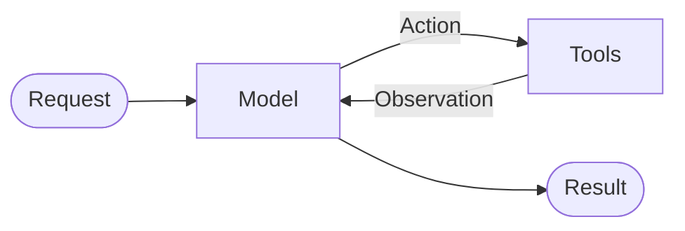
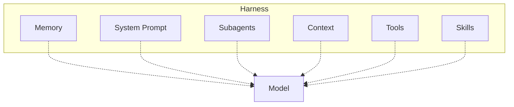

## Agents
An agent is a model calling tools in a loop until a given task is complete.

Agent = Model + Harness

A **harness** is everything around that loop: the prompt, the tools, and any middleware that shapes the model’s behavior.

# AI Models

AI models can be categorized in two main ways:

## 1. Free vs Paid

- **Free** → Can be used without paying, usually with usage/rate limits.
- **Paid** → You pay based on usage, commonly per token.

## 2. Closed Source vs Open Source

- **Closed Source** → Model weights/source are not publicly available. Usually accessed through an API.
- **Open Source / Open-Weight** → Model weights are available and can be **self-hosted on your own infrastructure**.

## OpenRouter

**OpenRouter** provides access to multiple AI models through a single API, including many **closed-source models** and open models, with both **free and paid** options.